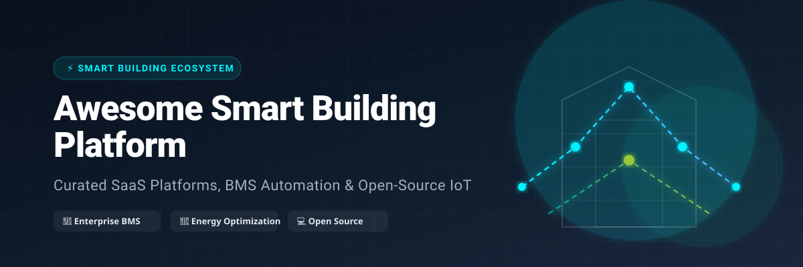

    

# 🏢 Awesome Smart Building Platform ⚡

> **A curated, battle-tested list of enterprise SaaS platforms, Building Management Systems (BMS), energy optimization software, IoT gateways, occupancy analytics, and open-source automation projects.**

---

## 📌 Table of Contents

- [🌐 Executive Summary & Overview](#-executive-summary--overview)
- [📊 Market Insights & Sector Fragmentation](#-market-insights--sector-fragmentation)
- [🏢 Enterprise SaaS & Hosted Platforms](#-enterprise-saas--hosted-platforms)
- [💻 Open-Source GitHub Projects](#-open-source-github-projects)
- [🛠️ Key Industry Protocols & Frameworks](#️-key-industry-protocols--frameworks)
- [🤝 How to Contribute](#-how-to-contribute)
- [⚠️ Disclaimer](#️-disclaimer)
- [📈 Star History](#-star-history)

---

## 🌐 Executive Summary & Overview

Modern commercial facilities require unified digital infrastructure to monitor, control, and optimize HVAC systems, lighting networks, sub-metering, space utilization, and ESG reporting. This repository tracks both established **commercial SaaS platforms** and **open-source building automation tools** designed for facility managers, energy engineers, building owners, systems integrators, and IoT technologists.

---

## 📊 Market Insights & Sector Fragmentation

> 💡 **Market Size & Structure**: The global **Smart Building & BMS Market** is estimated at **$95.4 Billion in 2024** and projected to expand to **$247.2 Billion by 2030** (CAGR of 17.2%). The sector is **moderately fragmented**: core hardware infrastructure and certified BMS controllers remain dominated by legacy industrial leaders (*Schneider Electric, Siemens, Honeywell, Johnson Controls*), while cloud-native ESG analytics, IoT data gateways, and AI-powered HVAC optimization are driven by agile, pure-play SaaS platforms (*Facilio, BrainBox AI, Enertiv, BuildingMinds*).

---

## 🏢 Enterprise SaaS & Hosted Platforms

*Sorted by Company Size / Market Scale (descending).*

| Platform 🔗 | Description 📝 | Company Size (Valuation / Revenue) 💰 | Starting Price 🏷️ | Free Tier / Free Trial Limits 🎁 |
| :--- | :--- | :--- | :--- | :--- |
| **[Schneider Electric EcoStruxure Building](https://www.se.com/)** | Open, IoT-enabled architecture for building management, energy efficiency, and integrated facility operations. | ~$120 Billion Market Cap (~$40B Revenue) | $150 / gateway / month (EcoStruxure Building Activate starting tier) | 30-day interactive demo trial (access to cloud platform simulation & test database) |
| **[Siemens Building X](https://www.siemens.com/)** | Cloud-native building software suite within the Siemens Xcelerator ecosystem for comfort, energy, safety, and operations. | ~$140 Billion Market Cap (~$22B Infrastructure Revenue) | $1,500 / site / year ($125 / month per connected app starting tier) | 6-month free trial (free promotional trial for selected Building X modules) |
| **[Honeywell Forge](https://www.honeywell.com/)** | Enterprise performance and building platform that unifies operational data, Niagara BMS, and predictive analytics. | ~$130 Billion Market Cap (~$37B Revenue) | $65 / site / month (Forge Performance+ starting site rate) | 14-day free trial (for Performance+ modules; 30-day guided pilot for analytics) |
| **[Johnson Controls OpenBlue](https://www.johnsoncontrols.com/)** | Smart building platform combining Metasys BMS heritage with cloud analytics, digital twins, and services for large facilities. | ~$45 Billion Market Cap (~$27B Revenue) | $2,500 / site / year ($208 / month baseline cloud analytics tier) | 30-day pilot trial (sales-configured trial environment for 1 location) |
| **[Spacewell](https://spacewell.com/)** | Workplace and building management solutions covering space utilization, energy analytics, and maintenance workflows. | ~$10 Billion Parent Valuation (~$45M ARR) | €3,500 / year base plan (€290 / month starting package) | 14-day demo trial (guided workspace access for 1 facility with sample sensor data) |
| **[Facilio](https://facilio.com/)** | Cloud-native connected building platform focused on maintenance, energy, and operations workflows for commercial facilities. | ~$120 Million Valuation (~$15M ARR) | $10,000 / year base enterprise tier ($833 / month base module) | 14-day free trial (sales-guided sandbox with full module access for up to 5 properties) |
| **[BrainBox AI](https://brainboxai.com/)** | AI-driven HVAC optimization platform that autonomously improves thermal comfort and energy efficiency. | ~$80 Million Valuation (~$10M ARR) | $0.25 / sq ft / year starting tier ($500 / month base building tier) | 30-day energy assessment trial (free baseline HVAC performance & energy audit) |
| **[Switch Automation](https://www.switchautomation.com/)** | Smart building operating system that aggregates data from multiple systems for analytics, control, and optimization. | ~$50 Million Valuation (~$8M ARR) | $1,200 / building / year ($100 / month base site monitoring tier) | 30-day trial pilot (evaluation trial limited to 1 site and 50 data points) |
| **[Enertiv](https://www.enertiv.com/)** | Real-time energy and equipment monitoring platform for commercial real estate portfolios and sub-metering. | ~$40 Million Valuation (~$5M ARR) | $0.015 / sq ft / month ($0.18 / sq ft / year, $100 / month base tier) | Free Portfolio Diagnostic plan (free forever baseline analysis limit using ESPM data) |
| **[BuildingMinds](https://buildingminds.com/)** | Digital twin and portfolio platform for real-estate ESG performance, carbon tracking, and decarbonization management. | ~$25 Million Valuation (~$3M ARR) | €19.90 / building / month (Self-Service starting tier) | 14-day free trial (full workspace features for up to 50 buildings) |

---

## 💻 Open-Source GitHub Projects

*Self-hosted open-source energy management, IoT data gateways, and building automation projects. Sorted by GitHub Star Count (descending).*

| Project 🔗 | GitHub_Stars ⭐ | Description 📝 | Key Tech Stack ⚙️ |
| :--- | :---: | :--- | :--- |
| **[home-assistant/core](https://github.com/home-assistant/core)** |  | World's most popular open-source automation platform, widely adapted for smart buildings, sub-metering, and sensor tracking. | Python, AsyncIO, React |
| **[node-red/node-red](https://github.com/node-red/node-red)** |  | Flow-based programming tool for wiring together hardware devices, BMS protocols (BACnet/Modbus), and cloud APIs. | Node.js, JavaScript |
| **[thingsboard/thingsboard](https://github.com/thingsboard/thingsboard)** |  | Open-source enterprise IoT platform for device management, building telemetry collection, and real-time dashboarding. | Java, SQL/Cassandra, Angular |
| **[eclipse/mosquitto](https://github.com/eclipse/mosquitto)** |  | Lightweight open-source MQTT message broker for IoT telemetry, sensor streaming, and edge-to-cloud communication. | C, MQTT |
| **[openhab/openhab-core](https://github.com/openhab/openhab-core)** |  | Vendor-agnostic smart building automation framework for integrating heterogeneous building devices and protocols. | Java, OSGi |
| **[emsesp/EMS-ESP32](https://github.com/emsesp/EMS-ESP32)** |  | Open-source ESP32 firmware for monitoring and controlling EMS/Heatronic heating systems, heat pumps, and thermostats. | C++, ESP32, MQTT |
| **[MyEMS/myems](https://github.com/MyEMS/myems)** |  | Leading open-source Energy Management System (EMS) aligned with ISO 50001 for electricity, water, gas, and carbon analytics. | Python, MySQL, React |
| **[bacnet-stack/bacnet-stack](https://github.com/bacnet-stack/bacnet-stack)** |  | Open-source C-based BACnet protocol stack providing MS/TP and BACnet/IP communication for commercial BMS controllers. | C, BACnet/IP, MS/TP |
| **[VOLTTRON/volttron](https://github.com/VOLTTRON/volttron)** |  | US Dept of Energy (PNNL) agent execution platform for building energy management, microgrid control, and FDD algorithms. | Python, ZMQ, Agent Framework |

---

## 🛠️ Key Industry Protocols & Frameworks

- **BACnet (ISO 16484-5)**: Standard building automation protocol for HVAC, lighting, and access control.
- **Modbus (RTU / TCP)**: Industrial serial communication protocol used in power meters, VFDs, and sensors.
- **Haystack / Brick Schema**: Open metadata schemas for annotating building assets, sensor tags, and spatial telemetry.
- **MQTT / Sparkplug B**: Lightweight publish-subscribe protocol ideal for IoT sensors and edge gateways.

---

## 🤝 How to Contribute

We welcome community contributions! Follow these steps to add or update entries:

1. 🍴 **Fork** this repository.
2. ✏️ **Edit** `README.md` following the table structure above.
3. 📝 Include: Project name, official website/repo URL, concise description, specific pricing/star count, and free tier details.
4. 🔀 **Open a Pull Request** with a brief summary of changes.

Check out our curated list index at [Awesome-Awesome-Awesome](https://github.com/ishandutta2007/Awesome-Awesome-Awesome)!

---

## ⚠️ Disclaimer

- This list is **community-curated** for informational purposes and does not constitute an endorsement.
- Building Management Systems affect operational safety, comfort, and energy consumption. Deployments must comply with local building codes, cybersecurity guidelines, and manufacturer specifications.

---

## 📈 Star History

---

**Made with ❤️ for facility managers, building owners, energy engineers, systems integrators, and smart-building technologists.**
